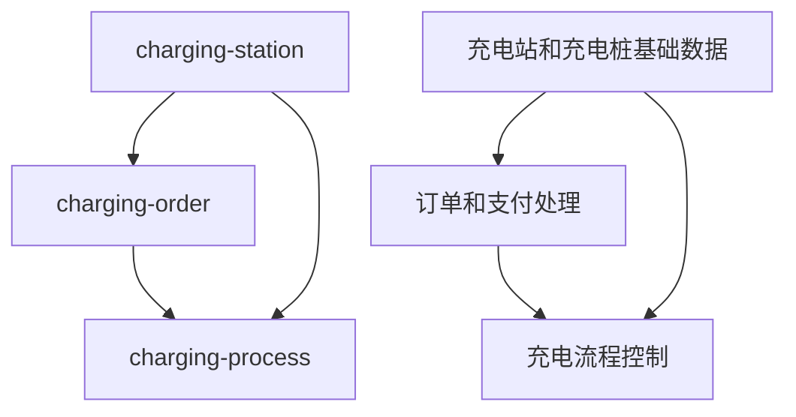

# 智慧充电服务平台开发计划

> 基于 Java 21 + Spring Boot 3 + Spring Cloud 的微服务架构充电服务系统

## 📊 项目现状分析

### 已完成模块
- ✅ **charging-process（充电流程模块）** 
  - 完整实现充电会话状态机
  - 包含完整的 DDD 架构设计
  - 使用 Java 21 特性（sealed interface、record）
  - 完整的测试覆盖（单元测试 + 集成测试）
  - 状态机支持 11 个状态和 12 个事件
  - 事件驱动架构，支持副作用解耦

### 待开发模块
- ⚪ **charging-station（充电站管理模块）** - 仅有基础框架，无业务代码
- ⚪ **charging-order（订单管理模块）** - 仅有基础框架，无业务代码

### 技术基础
- ✅ Java 21 + Spring Boot 3 + Spring Cloud 技术栈
- ✅ Gradle 多模块项目结构
- ✅ DDD 架构规范和代码规范
- ✅ 完整的业务需求文档和用户故事

## 🎯 开发优先级与依赖关系

基于业务流程分析，模块间的依赖关系为：

**开发顺序：**
1. **charging-station** → 提供充电站和充电桩基础数据
2. **charging-order** → 依赖 charging-station 的数据，处理订单和支付
3. **charging-process** → 依赖前两者，处理充电流程（已完成）

## 📋 详细开发计划

## 阶段一：充电站管理模块（charging-station）
**预计工期：5-7 天**

### 1.1 核心领域建模（1-2 天）
**目标：** 建立充电站领域的核心业务模型

**交付物：**
- **Station 聚合根**
  - 充电站基本信息（名称、地址、运营商）
  - 充电站状态管理（运营中、维护中、故障、关闭）
  - 业务规则封装（营业时间、服务范围）
  
- **Connector 实体**
  - 充电桩信息（类型、功率、协议）
  - 状态管理（空闲、占用、充电中、故障、离线、已预约）
  - 预约状态和时间管理
  
- **ParkingSpot 实体**
  - 车位信息（编号、类型、状态）
  - 地锁状态管理（升起、降下）
  - 与充电桩的关联关系
  
- **Location 值对象**
  - 地理位置信息（经纬度、地址）
  - 地理围栏功能支持
  
- **BusinessHours 值对象**
  - 营业时间管理
  - 特殊时间段处理

**技术要求：**
- 使用 Java 21 record 和 sealed interface
- 严格遵循 DDD 设计原则
- 聚合根封装业务不变量

### 1.2 基础设施层实现（1-2 天）
**目标：** 实现数据持久化和基础设施支持

**交付物：**
- 数据库设计和 DDL 脚本
- JPA 实体映射和注解配置
- Repository 接口定义
- Repository 实现（继承 JpaRepository）
- 数据库配置（H2 开发环境 + MySQL 生产环境）
- 缓存配置（Redis 集成）

**技术要求：**
- 使用 Spring Data JPA
- 支持多环境配置
- 实现软删除和审计字段

### 1.3 应用服务层（1-2 天）
**目标：** 实现业务逻辑协调和事务管理

**交付物：**
- **StationService**
  - 充电站创建、更新、查询
  - 充电站状态管理
  - 地理位置搜索功能
  
- **ConnectorService**
  - 充电桩状态查询和更新
  - 充电桩预约管理
  - 可用性检查
  
- **ParkingSpotService**
  - 车位状态管理
  - 地锁控制接口

**技术要求：**
- 事务边界管理
- 异常处理和重试机制
- 领域事件发布

### 1.4 接口层和测试（1 天）
**目标：** 提供 REST API 和完整测试覆盖

**交付物：**
- REST API 控制器
- API 文档（OpenAPI/Swagger）
- 单元测试（覆盖率 > 80%）
- 集成测试
- 性能测试

## 阶段二：订单管理模块（charging-order）
**预计工期：6-8 天**

### 2.1 核心领域建模（2-3 天）
**目标：** 建立订单和支付领域模型

**交付物：**
- **ChargingOrder 聚合根**
  - 订单生命周期管理
  - 订单状态机（初始、待支付、已支付、已完成、已取消）
  - 计费规则和金额计算
  
- **Reservation 实体**
  - 预约创建和管理
  - 预约超时处理
  - 预约限制规则（月度爽约限制）
  
- **Payment 实体**
  - 支付流程管理
  - 多渠道支付支持（支付宝、微信、钱包）
  - 支付状态跟踪
  
- **ChargingRecord 实体**
  - 充电记录详情
  - 电量和时长统计
  - 费用明细计算
  
- **Money 值对象**
  - 金额计算和精度处理
  - 货币类型支持

### 2.2 支付集成（2 天）
**目标：** 集成多种支付渠道

**交付物：**
- 支付渠道抽象接口
- 支付宝支付实现
- 微信支付实现
- 钱包支付实现
- 支付回调处理
- 支付状态同步机制

### 2.3 业务规则实现（1-2 天）
**目标：** 实现复杂业务规则

**交付物：**
- 预约规则引擎
- 计费策略实现
- 超时处理机制
- 爽约记录和限制
- 优惠券和折扣逻辑

### 2.4 接口层和测试（1 天）
**目标：** API 实现和测试

**交付物：**
- REST API 控制器
- 与 charging-process 的集成测试
- 支付流程端到端测试
- 性能和压力测试

## 阶段三：微服务架构完善（charging-gateway + charging-common）
**预计工期：4-5 天**

### 3.1 API 网关模块（2-3 天）
**目标：** 统一入口和服务治理

**交付物：**
- Spring Cloud Gateway 配置
- 路由规则和负载均衡
- 认证授权集成
- 限流和熔断机制
- API 版本管理

### 3.2 公共模块（1-2 天）
**目标：** 共享组件和工具

**交付物：**
- 通用工具类和常量
- 共享的领域对象
- 统一异常处理
- 通用配置和属性
- 日志和监控组件

## 阶段四：系统集成与优化（3-4 天）

### 4.1 模块间集成（1-2 天）
**目标：** 实现服务间协作

**交付物：**
- 服务间通信机制
- 分布式事务处理
- 事件驱动架构完善
- 数据一致性保证

### 4.2 监控和运维（1-2 天）
**目标：** 生产环境支持

**交付物：**
- 日志聚合和分析
- 健康检查和监控
- 部署脚本和 Docker 化
- 性能调优和优化

## 🛠 技术实施策略

### 开发原则
1. **DDD 优先**：严格按照领域驱动设计原则
2. **测试驱动**：每个模块都要有完整的测试覆盖
3. **Java 21 特性**：充分利用 sealed interface、record、pattern matching 等
4. **事件驱动**：模块间通过领域事件解耦
5. **渐进式开发**：每个阶段都要有可运行的版本

### 质量保证
- 单元测试覆盖率 > 80%
- 集成测试覆盖核心业务流程
- 代码审查和静态分析
- 性能测试和压力测试
- API 文档完整性检查

## 📅 时间规划

| 阶段 | 模块 | 工期 | 里程碑 | 关键交付物 |
|------|------|------|--------|------------|
| 1 | charging-station | 5-7 天 | 充电站管理功能完成 | Station/Connector 领域模型、REST API |
| 2 | charging-order | 6-8 天 | 订单支付流程完成 | Order/Payment 领域模型、支付集成 |
| 3 | gateway + common | 4-5 天 | 微服务架构完善 | API 网关、公共组件 |
| 4 | 集成优化 | 3-4 天 | 系统整体可用 | 端到端测试、部署方案 |
| **总计** | | **18-24 天** | **MVP 版本发布** | **完整的充电服务平台** |

## 🎯 下一步行动建议

### 立即开始
1. **charging-station 模块的领域建模**
   - 分析充电站业务规则
   - 设计聚合根和实体关系
   - 定义值对象和枚举

### 并行准备
2. **charging-order 模块的需求细化**
   - 梳理订单状态流转
   - 分析支付集成需求
   - 设计计费规则

### 技术预研
3. **支付集成和网关配置方案**
   - 调研支付 SDK 集成方式
   - 设计网关路由策略
   - 准备开发环境配置

---

**文档版本：** v1.0  
**创建时间：** 2025-06-23  
**最后更新：** 2025-06-23  
**负责人：** 开发团队
