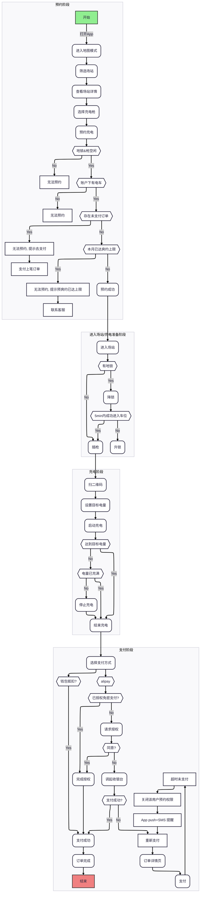

```mermaid
---
config:
      theme: redux
---

flowchart-elk
    subgraph 预约阶段
        A[开始] -- 打开App --> B(进入地图模式)
        B --> C(筛选场站)
        C --> D(查看场站详情)
        D --> E(选择充电枪)
        E --> F(预约充电)
        F --> G{{地锁&枪空闲}} -- No --> Q[无法预约]
        G -- Yes --> H{{账户下有电车}}-- No --> R[无法预约]
        H -- Yes --> I{{存在未支付订单}}
        I -- Yes --> J[无法预约, 提示去支付] --> J1[支付上笔订单]
        I -- No --> K{{本月已达爽约上限}}
        K -- Yes --> L[无法预约, 提示预爽约已达上限] --> L1[联系客服]
        K -- No --> M(预约成功)
    end

    subgraph 进入场站/充电准备阶段
        M --> S(进入场站)
        S --> T{{有地锁}}
        T -- Yes --> U(降锁)
        U --> V{{5min内成功进入车位}}-- No --> X(升锁)
        V -- Yes --> W(插枪)
        T -- No --> W
    end

    subgraph 充电阶段
        W --> Y(扫二维码)
        Y --> Z(设置目标电量)
        Z --> AA(启动充电)
        AA --> AB{{达到目标电量}}
        AB -- Yes --> AD(结束充电)
        AB -- No --> AB2{{电量已充满}} --Yes --> AD(结束充电)
        AB2-- No --> AC(停止充电) --> AD(结束充电)
    end

    subgraph 支付阶段
        AD --> AE(选择支付方式)
        AE --> AF{{钱包抵扣?}}
        AE --> AG{{alipay}}

        AG --> AH{{已授权免密支付?}}
        AH -- Yes --> AI(完成授权)
        AH -- No --> AJ(请求授权)
        AJ --> AK{{同意?}}
        AK -- Yes --> AI
        AK -- No --> AL(调起收银台)
        AL --> AM{{支付成功?}}
        AM -- Yes --> AN(支付成功)
        AM -- No --> AO[重新支付]
        AO --> AP(订单详情页)
        AP --> AQ(支付)
        AQ --> AR[超时未支付]
        AR --> AS[关闭该用户预约权限]
        AS --> AT[App push+SMS 提醒]
        AT --> AO

        AF -- Yes --> AN
        AI --> AN
        AN --> AU(订单完成)
        AU --> End[结束]
    end

    style A fill:#90EE90,stroke:#333,stroke-width:2px
    style End fill:#F08080,stroke:#333,stroke-width:2px

```