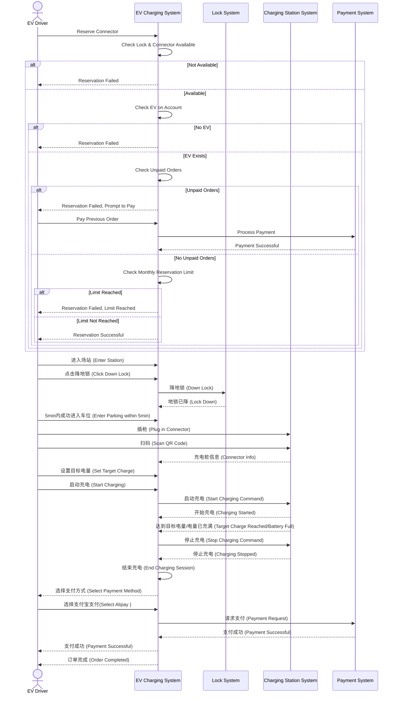

```mermaid

sequenceDiagram
    actor EV Driver
    participant EV Charging System
    participant Lock System
    participant Charging Station System
    participant Payment System

    EV Driver ->> EV Charging System: Reserve Connector
    EV Charging System ->> EV Charging System: Check Lock & Connector Available
    alt Not Available
        EV Charging System -->> EV Driver: Reservation Failed
    else Available
        EV Charging System ->> EV Charging System: Check EV on Account
        alt No EV
            EV Charging System -->> EV Driver: Reservation Failed
        else EV Exists
            EV Charging System ->> EV Charging System: Check Unpaid Orders
            alt Unpaid Orders
                EV Charging System -->> EV Driver: Reservation Failed, Prompt to Pay
                EV Driver ->> EV Charging System: Pay Previous Order
                EV Charging System ->> Payment System: Process Payment
                Payment System -->> EV Charging System: Payment Successful
            else No Unpaid Orders
                EV Charging System ->> EV Charging System: Check Monthly Reservation Limit
                alt Limit Reached
                    EV Charging System -->> EV Driver: Reservation Failed, Limit Reached
                else Limit Not Reached
                    EV Charging System -->> EV Driver: Reservation Successful
                end
            end
        end
    end

    EV Driver ->> EV Charging System: 进入场站 (Enter Station)
    EV Driver ->> EV Charging System: 点击降地锁 (Click Down Lock)
    EV Charging System ->> Lock System: 降地锁 (Down Lock)
    Lock System -->> EV Charging System: 地锁已降 (Lock Down)
    EV Driver ->> EV Charging System: 5min内成功进入车位 (Enter Parking within 5min)
    EV Driver ->> Charging Station System: 插枪 (Plug in Connector)

    EV Driver ->> Charging Station System: 扫码 (Scan QR Code)
    Charging Station System -->> EV Charging System:  充电桩信息 (Connector Info)
    EV Driver ->> EV Charging System: 设置目标电量 (Set Target Charge)
    EV Driver ->> EV Charging System: 启动充电 (Start Charging)
    EV Charging System ->> Charging Station System: 启动充电 (Start Charging Command)
    Charging Station System -->> EV Charging System: 开始充电 (Charging Started)
    Charging Station System -->> EV Charging System:  达到目标电量/电量已充满 (Target Charge Reached/Battery Full)
    EV Charging System ->> Charging Station System: 停止充电 (Stop Charging Command)
    Charging Station System -->> EV Charging System: 停止充电 (Charging Stopped)
    EV Charging System ->> EV Charging System: 结束充电 (End Charging Session)

    EV Charging System -->> EV Driver: 选择支付方式 (Select Payment Method)
    EV Driver ->> EV Charging System: 选择支付宝支付(Select Alipay )
    EV Charging System ->> Payment System: 请求支付 (Payment Request)
    Payment System -->> EV Charging System: 支付成功 (Payment Successful)
    EV Charging System -->> EV Driver: 支付成功 (Payment Successful)
    EV Charging System -->> EV Driver: 订单完成 (Order Completed)

```