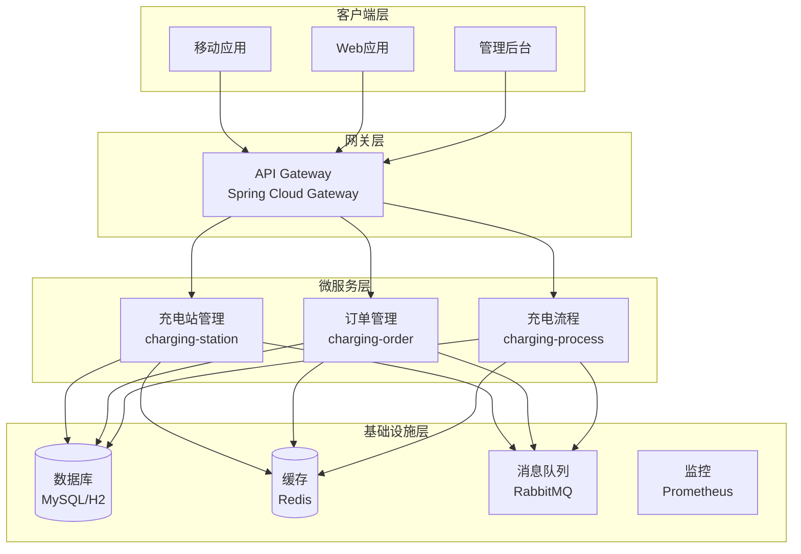
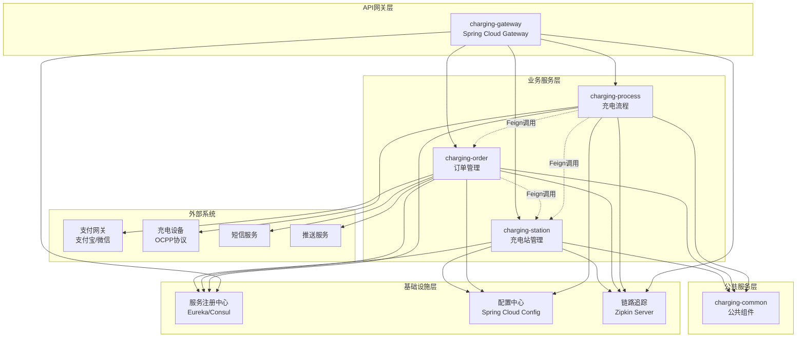
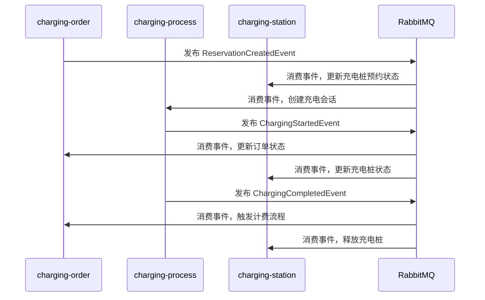

# 技术架构设计文档

> 智慧充电服务平台技术架构和设计决策

## 🏗 整体架构概览

### 架构风格
- **微服务架构**：模块化设计，独立部署和扩展
- **领域驱动设计（DDD）**：以业务领域为核心的设计方法
- **事件驱动架构**：通过领域事件实现模块间解耦
- **CQRS 模式**：命令查询职责分离，优化读写性能

### 系统架构图



## 🛠 技术栈选型

### 核心框架
- **Java 21**：最新 LTS 版本，支持现代语言特性
- **Spring Boot 3.3.0**：企业级应用框架
- **Spring Cloud 2023.0.1**：微服务治理框架
- **Gradle 8.x**：构建工具，支持多模块项目

### 数据存储
- **MySQL 8.0**：主数据库，支持事务和复杂查询
- **H2 Database**：开发和测试环境内存数据库
- **Redis 7.x**：缓存和会话存储
- **Elasticsearch**：日志搜索和分析（可选）

### 服务治理
- **Spring Cloud OpenFeign**：声明式服务调用客户端
- **Spring Cloud LoadBalancer**：客户端负载均衡
- **Spring Cloud Sleuth**：分布式链路追踪
- **Zipkin**：链路追踪数据收集和展示

### 消息中间件
- **RabbitMQ**：可靠的消息队列
- **Spring Cloud Stream**：消息驱动微服务框架

### 监控和运维
- **Prometheus + Grafana**：监控和可视化
- **ELK Stack**：日志聚合和分析
- **Spring Boot Actuator**：健康检查和指标
- **Zipkin**：分布式链路追踪可视化
- **Docker + Kubernetes**：容器化部署

## � 模块关系设计

### 模块依赖关系图



### 服务调用关系

#### 1. charging-order → charging-station
**调用场景：**
- 创建预约时查询充电站和充电桩信息
- 验证充电桩可用性和状态
- 获取充电站地理位置和营业时间
- 查询车位和地锁状态

**Feign 接口示例：**
```java
@FeignClient(name = "charging-station", path = "/api/v1/stations")
public interface StationFeignClient {
    @GetMapping("/{stationId}")
    StationDTO getStation(@PathVariable Long stationId);

    @GetMapping("/{stationId}/connectors/{connectorId}")
    ConnectorDTO getConnector(@PathVariable Long stationId, @PathVariable Long connectorId);

    @PostMapping("/{stationId}/connectors/{connectorId}/reserve")
    void reserveConnector(@PathVariable Long stationId, @PathVariable Long connectorId, @RequestBody ReservationRequest request);
}
```

#### 2. charging-process → charging-station
**调用场景：**
- 充电会话开始时验证充电桩状态
- 更新充电桩占用状态
- 获取充电桩技术参数
- 地锁控制操作

**Feign 接口示例：**
```java
@FeignClient(name = "charging-station", path = "/api/v1/connectors")
public interface ConnectorFeignClient {
    @PutMapping("/{connectorId}/status")
    void updateConnectorStatus(@PathVariable Long connectorId, @RequestBody ConnectorStatusRequest request);

    @PostMapping("/{connectorId}/lock/down")
    void lockDown(@PathVariable Long connectorId);

    @PostMapping("/{connectorId}/lock/up")
    void lockUp(@PathVariable Long connectorId);
}
```

#### 3. charging-process → charging-order
**调用场景：**
- 充电开始时获取订单信息
- 充电结束时更新充电记录
- 触发计费和支付流程
- 查询预约信息

**Feign 接口示例：**
```java
@FeignClient(name = "charging-order", path = "/api/v1/orders")
public interface OrderFeignClient {
    @GetMapping("/session/{sessionId}")
    ChargingOrderDTO getOrderBySessionId(@PathVariable Long sessionId);

    @PostMapping("/{orderId}/charging-records")
    void createChargingRecord(@PathVariable Long orderId, @RequestBody ChargingRecordRequest request);

    @PutMapping("/{orderId}/complete")
    void completeOrder(@PathVariable Long orderId, @RequestBody OrderCompletionRequest request);
}
```

### 事件驱动通信

除了同步的 Feign 调用，模块间还通过异步事件进行解耦通信：

#### 领域事件流转


## �📦 模块设计

### charging-station（充电站管理）
**职责：** 充电站、充电桩、车位信息管理

**核心组件：**
- Station 聚合根：充电站信息和状态管理
- Connector 实体：充电桩状态和预约管理
- ParkingSpot 实体：车位和地锁管理
- Location 值对象：地理位置信息

**技术特点：**
- 地理位置搜索（GIS 功能）
- 实时状态同步
- 缓存优化查询性能

### charging-order（订单管理）
**职责：** 充电订单、预约、支付管理

**核心组件：**
- ChargingOrder 聚合根：订单生命周期管理
- Reservation 实体：预约管理和限制
- Payment 实体：多渠道支付集成
- ChargingRecord 实体：充电记录和计费

**技术特点：**
- 复杂业务规则引擎
- 多支付渠道集成
- 分布式事务处理

### charging-process（充电流程）
**职责：** 充电会话状态机和流程控制

**核心组件：**
- ChargeSession 聚合根：状态机核心
- TransitionTable：状态转换规则
- 领域事件：状态变更通知
- 事件监听器：副作用处理

**技术特点：**
- 复杂状态机实现
- 事件驱动架构
- 高并发处理能力

## 🔧 设计模式和原则

### DDD 战术模式
- **聚合根（Aggregate Root）**：封装业务不变量
- **实体（Entity）**：有唯一标识的业务对象
- **值对象（Value Object）**：不可变的属性集合
- **领域服务（Domain Service）**：跨聚合的业务逻辑
- **仓储（Repository）**：聚合的持久化抽象
- **领域事件（Domain Event）**：业务状态变更通知

### 设计原则
- **单一职责原则**：每个类只有一个变更理由
- **开闭原则**：对扩展开放，对修改关闭
- **依赖倒置原则**：依赖抽象而非具体实现
- **接口隔离原则**：客户端不应依赖不需要的接口

### 架构模式
- **分层架构**：展现层、应用层、领域层、基础设施层
- **六边形架构**：端口和适配器模式
- **CQRS**：命令查询职责分离
- **事件溯源**：通过事件重建状态（部分场景）

## 🔐 安全设计

### 认证授权
- **JWT Token**：无状态认证
- **OAuth 2.0**：第三方登录集成
- **RBAC**：基于角色的访问控制

### 数据安全
- **数据加密**：敏感数据加密存储
- **传输安全**：HTTPS/TLS 加密传输
- **SQL 注入防护**：参数化查询
- **XSS 防护**：输入验证和输出编码

### 接口安全
- **API 限流**：防止恶意请求
- **参数验证**：严格的输入验证
- **错误处理**：不暴露敏感信息
- **审计日志**：操作记录和追踪

## 📊 性能设计

### 缓存策略
- **多级缓存**：本地缓存 + 分布式缓存
- **缓存模式**：Cache-Aside、Write-Through
- **缓存失效**：TTL + 主动失效
- **缓存预热**：系统启动时预加载热点数据

### 数据库优化
- **索引设计**：基于查询模式优化索引
- **分库分表**：水平扩展支持（预留）
- **读写分离**：主从复制，读写分离
- **连接池**：数据库连接池优化

### 并发处理
- **乐观锁**：版本号控制并发更新
- **分布式锁**：Redis 实现分布式锁
- **异步处理**：非阻塞 I/O 和异步任务
- **限流熔断**：Resilience4j

## 🚀 部署架构

### 容器化
- **Docker**：应用容器化
- **Docker Compose**：本地开发环境
- **Kubernetes**：生产环境编排

### 环境管理
- **开发环境**：本地 H2 数据库
- **测试环境**：独立的测试数据库
- **预生产环境**：生产环境镜像
- **生产环境**：高可用集群部署

### CI/CD 流程
- **代码提交**：Git 版本控制
- **自动构建**：GitHub Actions
- **自动测试**：单元测试 + 集成测试
- **自动部署**：蓝绿部署/滚动更新

## 📈 监控和运维

### 应用监控
- **健康检查**：Spring Boot Actuator
- **性能指标**：JVM、数据库、缓存指标
- **业务指标**：订单量、充电量、收入等
- **错误监控**：异常捕获和告警

### 日志管理
- **结构化日志**：JSON 格式日志
- **日志聚合**：ELK Stack 集中管理
- **日志分级**：ERROR、WARN、INFO、DEBUG
- **敏感信息脱敏**：避免记录敏感数据

### 告警机制
- **阈值告警**：CPU、内存、磁盘使用率
- **业务告警**：订单异常、支付失败
- **可用性告警**：服务不可用、响应超时
- **多渠道通知**：邮件、短信、钉钉

## 🔄 数据流设计

### 同步数据流
- **API 调用**：服务间同步通信
- **数据库事务**：ACID 保证数据一致性
- **缓存同步**：实时更新缓存数据

### 异步数据流
- **领域事件**：业务状态变更通知
- **消息队列**：解耦服务间通信
- **事件溯源**：通过事件重建状态

### 数据一致性
- **强一致性**：同步事务保证
- **最终一致性**：异步事件驱动
- **补偿机制**：失败场景的数据修复

---

**文档版本：** v1.0  
**创建时间：** 2025-06-23  
**最后更新：** 2025-06-23  
**审核状态：** 待审核
